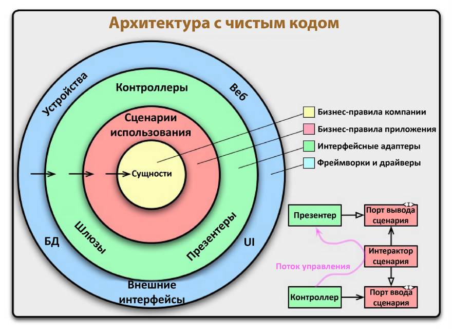
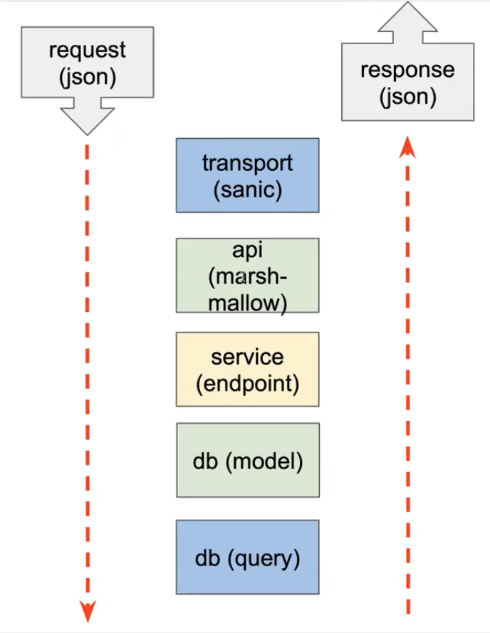

# NapoleonIT Project

Соло-проект, созданный во время прохождения курса в школе NapoleonIT [(Python BackEnd Developer Course)](https://backend.napoleonit.ru)

## About

Разработка BackEnd части для оффлайн мессенджера. Предполагается, что пользователь может отправлять сообщения для другого пользователя, 
зная его логин. Все сообщения хранятся в базе данных. Оповещение о новых сообщениях для пользователя не требуется, пользователь
сам запрашивает данные по API

## Стек технологий

- **Sanic** - в качестве веб-сервера
- **marshmallow** - для валидации данных
- **SQLite3** - база данных
- **SQLAlchemy** - ORM
- **Alembic** - для создания миграций

## Использование
Перед запуском приложения необходимо в корневой директории создать файл `.env` и поместить туда следующие элементы:

    host = <адрес приложения>
    port = <порт>
    workers = <количество воркеров>
    debug = <debug status (true/false)>
    dbname = <имя базы данных>

Данный шаг можно опустить, тогда все значения примут значения по умолчанию.

Затем требуется активировать виртуальное окружение:

    venv\Scripts\activate.bat

Далее требуется загрузить все необходимые зависимости с помощью следующей команды:

    pip install -r requirements.txt

## Описание API
### Создание пользователя

    /user "POST"
        request: {
            "login": str,
            "password": str,
            "first_name": str,
            "last_name": str
        }
        response: {}

### Получение информации о пользователе
Доступно только для своего пользователя

    /user 'GET'
        request: {}
        response: {
            "login": str,
            "first_name": str,
            "last_name": str
        }

### Изменение информации о пользователе
Доступно только для своего пользователя

    /user "PATCH"
        request: {
            "password": str?,
            "first_name": str?,
            "last_name": str?
        }
        response: {}

### Создание сообщения
Доступно только для авторизированного пользователя

    /msg "POST"
        request: {
            "message": str,
            "recipient": str
        }
        response: {}

### Получение сообщений
Доступно только для авторизированного пользователя

    /msg "GET"
        request: {}
        response: {
            "messages": list
        }

### Сторонние методы
#### Поиск пользователя с определенным логином/id

## Чистая архитектура
Приложение спроектировано на основе идеи чистой архитектуры, которая заключается в том, что код разделяется на слои так, чтобы эти слои минимально зависили друг от друга и было легкозаменяемыми. 

### Идея чистой архитектуры
1. **Независимость от фреймворка.** Архитектура не зависит от существования какой-либо библиотеки. Это позволяет использовать фреймворк в качестве инструмента, вместо того, чтобы втискивать свою систему в рамки его ограничений.
2. **Тестируемость.** Бизнес-правила могут быть протестированы без пользовательского интерфейса, базы данных, веб-сервера или любого другого внешнего компонента. 
3. **Независимость от UI.** Пользовательский интерфейс можно легко изменить, не изменяя остальную систему. Например, веб-интерфейс может быть заменен на консольный без изменения бизнес-правил.
4. **Независимость от базы данных.** Вы можете поменять Oracle или SQL Server на MongoDB, BigTable, CouchDB или что-либо еще. Ваши бизнес-правила не связаны с базой данных.
5. **Независимость от какого-либо внешнего ресурса.** По факту ваши бизнес-правила просто ничего не знают о внешнем мире.

## Схема запросов

## Developer
Daniil Sobolev - daniil.sob56@gmail.com (telegram: [dansobolev](https://t.me/dansobolev))
