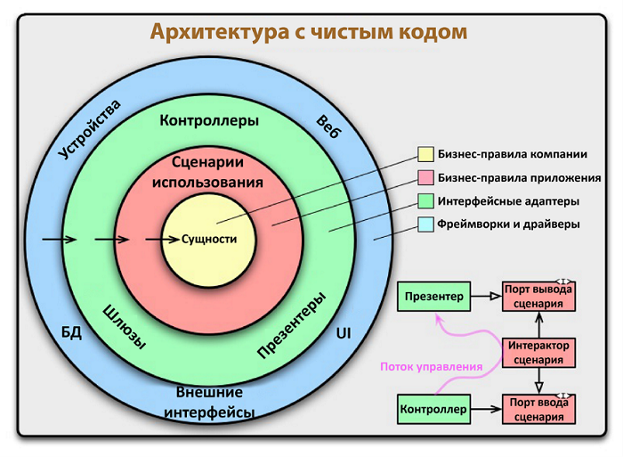

# NapoleonIT Project

Team Project that was created during course in NapoleonIT (Python BackEnd Developer Course)

## About

Разработка Backend части для приложения по распределению задач между сотрудниками в организации посредством API (наподобие Trello).

## Чистая архитектура

Приложение спроектировано на основе идеи чистой архитектуры, которая заключается в том, что код разделяется на слои так, чтобы эти слои минимально зависили друг от друга и было легкозаменяемыми. 
### Идея чистой архитектуры
1. **Независимость от фреймворка.** Архитектура не зависит от существования какой-либо библиотеки. Это позволяет использовать фреймворк в качестве инструмента, вместо того, чтобы втискивать свою систему в рамки его ограничений.
2. **Тестируемость.** Бизнес-правила могут быть протестированы без пользовательского интерфейса, базы данных, веб-сервера или любого другого внешнего компонента. 
3. **Независимость от UI.** Пользовательский интерфейс можно легко изменить, не изменяя остальную систему. Например, веб-интерфейс может быть заменен на консольный без изменения бизнес-правил.
4. **Независимость от базы данных.** Вы можете поменять Oracle или SQL Server на MongoDB, BigTable, CouchDB или что-либо еще. Ваши бизнес-правила не связаны с базой данных.
5. **Независимость от какого-либо внешнего ресурса.** По факту ваши бизнес-правила просто ничего не знают о внешнем мире.

## Схема запросов

## Usage

Will be updated soon

## Technology stack

- **Sanic** - as a web server
- **marshmallow** - as a data validation tool
- **SQLite3** - as a database
- **SQLAlchemy** - as an ORM
- **Alembic** - as a database migration tool

## Developer
Daniil Sobolev - daniil.sob56@gmail.com 
